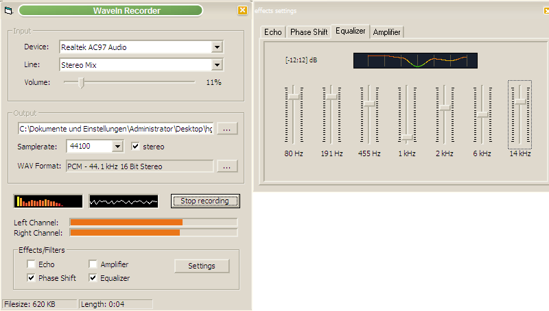



## WaveIn Recorder

### Description

Uses the waveIn API to record audio signals.

You can change the recording source while recording and change its volume. The recorded samples get saved to a WAV file, with full ACM support, so you can even use an MP3 codec, if installed.

The recorded samples get visualized through a frequency spectrum (Ulli's FFT class) and an amplitudes curve. Tested with XP. /// Update: Replaced the common dialog control with a class by Bill Bither (found at PSC), added some comments to the code, cleaned up a bit /// Update: fake window will be ceated only on start of recording, secured some parts in WaveInRecorder where pointers are used /// Update...: replaced subclassing with Paul Caton's technique /// update...: mixer functions should work fine now, uses a real mixer handle now ;), also the inverted line selection bug is fixed /// and once more...: mixer functions should be really stable now, added effects (echo, amplify, phase shift, 7 band graphical equalizer). Tipp: add echo, give it a short length (about 4-5 pixels to the left from the default) and set the echo amp to 6, makes your recording sound like a robot :)
 
### More Info
 

             |
---                |---
**Submitted On**   |2006-06-15 17:44:02
**By**             |[Arne Elster](https://github.com/Planet-Source-Code/PSCIndex/blob/master/ByAuthor/arne-elster.md)
**Level**          |Advanced
**User Rating**    |5.0 (305 globes from 61 users)
**Compatibility**  |VB 6\.0
**Category**       |[Sound/MP3](https://github.com/Planet-Source-Code/PSCIndex/blob/master/ByCategory/sound-mp3__1-45.md)
**World**          |[Visual Basic](https://github.com/Planet-Source-Code/PSCIndex/blob/master/ByWorld/visual-basic.md)
**Archive File**   |[WaveIn\_Rec2001136152006\.zip](https://github.com/Planet-Source-Code/arne-elster-wavein-recorder__1-65662/archive/master.zip)

